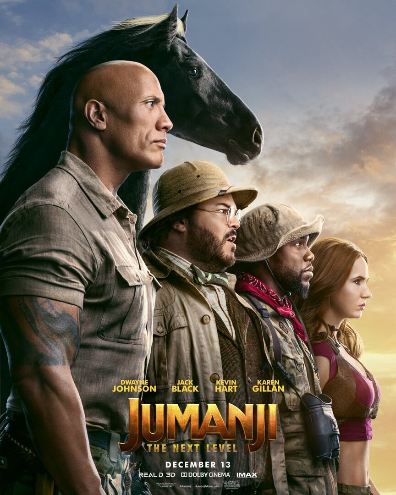
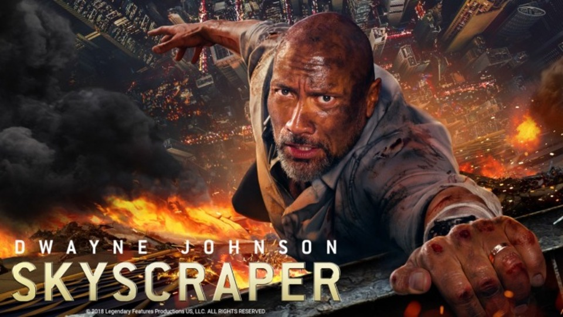
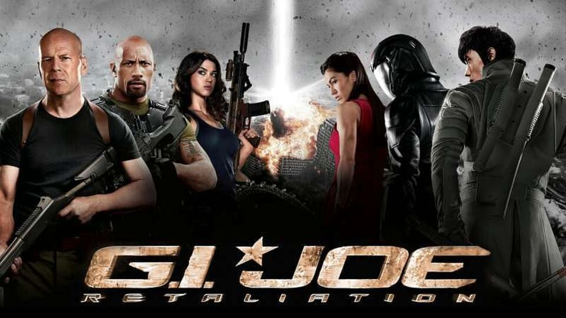

# CV Task 

## 1. Creating a random image 

In this task we create a random image using numpy and show it using matplotlib. 
We know that a gray scale image is just an array with each value being the RGB value of that pixel. So we create a 2D array with values ranging between 0-255. 

We use random module's randint function to randomly place an integer value between 0-255 in each pixel value. Here we have created an image of 100x100 dimension. 

### Code

### Output

Here we have obtained an random noisy image. 

## 2. Face swap

In this task we take an image and swap the faces of the characters in the image. 

For this we use harcasscade face detector to get the exact coordinates of the face of the characters. Then we do simple numpy operations to swap the faces. 

### Code

### Input/Original Image

### Output Image (I know its really bad 😑)

## 3. Creating a Movie collage using code

In this task we take a few movie posters and combine them to create a collage. 

For this we use pure python code and some basic numpy operations. 

### Code

### Input Images 

### Output

